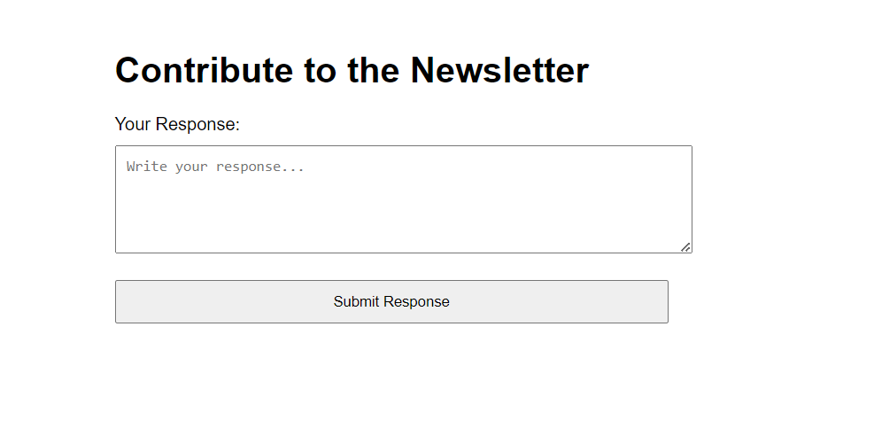
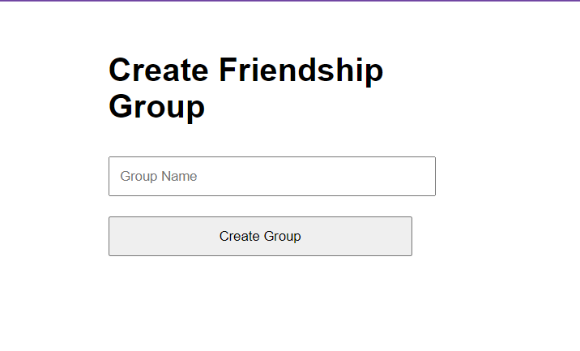

# Memory Threads

## Overview


"Memory Threads" is a charming and heartfelt app designed to keep the magic of friendship alive, one shared story at a time. Imagine a cozy digital nook where friends come together to weave a beautiful monthly newsletter, filled with laughter, stories, and pictures that paint the picture of their current lives. Each edition is like a warm hug from the past, capturing the essence of friendship in heartfelt responses to prompts like "What made you smile this month?" or snapshots that say "Wish you were here!"

With a sprinkle of nostalgia, the app also offers a delightful timeline feature – a memory lane where friends can stroll down and revisit the newsletters of yesteryears, reliving memories and smiles. "Memory Threads" isn’t just an app; it’s a shared diary, a collection of moments, and a treasure trove of the silly, the significant, and everything in between. It’s where distance doesn’t dim the warmth of friendship, and time spent apart only makes the shared stories sweeter.


In a digital realm overflowing with fleeting likes and quick comments, "Memory Threads" offers a sanctuary for friends seeking a more profound connection. This app is a heartfelt answer to the shallow pools of social media, inviting friends to dive deeper than the occasional "hello" and the conversations that fade too quickly. It’s a dedicated space for those amazing, pure friendships that, though threatened by the drift of post-graduation life, are too precious to let slip away. "Memory Threads" nurtures these bonds by encouraging continuous, intimate sharing, allowing for a group's collective narrative to flourish even as new chapters unfold individually. It's where the essence of true friendship is not only preserved but celebrated and allowed to grow, undiminished by the miles or years that may separate us.


## Data Model

In "Memory Threads," the application's data architecture is designed to capture the essence of enduring friendships and shared histories. The relationships between the different data entities are as follows:

- `Users` form the core of the application, each with a unique profile.
- Each `User` can be part of one or many `FriendshipGroups`, which are clusters of users who participate in creating and sharing `Newsletters`.
- `FriendshipGroups` are responsible for the generation of `Newsletters` on a predetermined schedule (e.g., monthly).
- `Newsletters` consist of various `Prompts`, which are creative questions or conversation starters proposed by the users.
- Users respond to these `Prompts` with `Responses`, which can include textual stories, images, or any meaningful content.
- The `Responses` are then compiled to form the `Newsletter`, which is distributed among the members of the respective `FriendshipGroup`.
- `Timelines` represent a sequential collection of `Newsletters` and `Responses`, embodying the shared journey of the group.
- `Memories` are highlighted elements such as photos, videos, or text entries that users contribute, tied to a `Newsletter` but also kept separately for posterity and reflection.

Below are sample MongoDB document structures that illustrate how the data is organized:

### Example User Document

```javascript
{
  username: "foreverfriend",
  password: // a password hash,
  email: "friend@example.com",
  friendshipGroups: // an array of references to FriendshipGroup documents
}
```

### Example FriendshipGroup Document

```javascript
{
  groupName: "College Buddies",
  members: // an array of references to User documents,
  newsletters: // an array of references to Newsletter documents
}
```

### Example Newsletter Document

```JS
{
  friendshipGroup: // a reference to a FriendshipGroup document,
  issueDate: // timestamp of newsletter creation,
  prompts: [
    { 
      promptText: "What’s a recent challenge you overcame?",
      responses: // an array of references to Response documents
    },
    { 
      promptText: "Share a picture from a place you visited this month!",
      responses: // an array of references to Response documents
    },
  ],
  memories: // an array of references to Memory documents (pictures, videos, etc.)
}
```

### Example Response Document
```JS
{
  user: // a reference to a User document,
  prompt: // a reference to the Prompt it belongs to,
  content: "I finally finished my first marathon!",
  attachments: // an array of image/video URLs or document references,
  createdAt: // timestamp
}
```

### Example Memory Document

```JS
{
  user: // a reference to a User document,
  newsletter: // a reference to the Newsletter it is associated with,
  content: "Picture from our last day at the campus",
  url: // URL or a reference to the stored image/video,
  sharedAt: // timestamp
}

```

## Database Schemas

The database schemas are defined using Mongoose and are structured to represent users, their friendship groups, newsletters, responses, and memories. The schemas are defined in the [`db.mjs`](./db.mjs)  file.

## Wireframes

/profile/create 

[HTML Wireframe](./documentation/html-wireframes/profile-creation.html)


/newsletter

[HTML Wireframe](./documentation/html-wireframes/newsletter.html)



/friendgroup

[HTML Wireframe](./documentation/html-wireframes/friendgroup.html)



## Site map

(__TODO__: draw out a site map that shows how pages are related to each other)

Here's a [complex example from wikipedia](https://upload.wikimedia.org/wikipedia/commons/2/20/Sitemap_google.jpg), but you can create one without the screenshots, drop shadows, etc. ... just names of pages and where they flow to.

## User Stories

### Core User Stories

1. **As a user**, I want to create a personal profile, so that I can have a personalized experience and be identifiable by my friends within the app.
2. **As a user**, I want to join and form friendship groups, so that I can maintain a circle of friends to share newsletters with.
3. **As a member of a friendship group**, I want to contribute to a collaborative newsletter, so that I can share updates and stay connected with my friends.
4. **As a user**, I want to receive a recurring newsletter, so that I can see what's new with my friends and reminisce about past times.
5. **As a user**, I want to respond to prompts in the newsletter, so that I can share my thoughts, experiences, and memories with the group.
6. **As a user**, I want to be able to view past newsletters, so that I can revisit memories and stories shared by my friends over time.
7. **As a user**, I want to be able to submit photos, etc as 'Memories', so that they can be preserved and easily accessed in the future.
8. **As a user**, I want to have a timeline view of the memories and newsletters, so that I can experience the journey my friends and I have had over the years.
9. **As a user**, I want to receive notifications/reminders to contribute to the upcoming newsletter, so that I don't miss the chance to share and stay updated.
10. **As a user**, I want to be able to customize the prompts or questions for our newsletter, so that they can reflect the interests and needs of my friend group.

### Additional/Stretch User Stories

1. **As a user with many friend groups**, I want to easily switch between different group newsletters, so that I can manage multiple friend circles easily.
2. **As a user**, I want to export a newsletter to a PDF or print format, so that I can have a physical copy of our memories.
3. **As a user**, I want the ability to 'react' to friends' stories or photos, so that I can engage with the content they share.
4. **As a privacy-conscious user**, I want to control who sees my contributions, so that I can share sensitive updates confidently within my trusted circle.


## Research Topics

(__TODO__: the research topics that you're planning on working on along with their point values... and the total points of research topics listed)

* (5 points) Integrate user authentication
    * I'm going to be using passport for user authentication
    * And account has been made for testing; I'll email you the password
    * see <code>cs.nyu.edu/~jversoza/ait-final/register</code> for register page
    * see <code>cs.nyu.edu/~jversoza/ait-final/login</code> for login page
* (4 points) Perform client side form validation using a JavaScript library
    * see <code>cs.nyu.edu/~jversoza/ait-final/my-form</code>
    * if you put in a number that's greater than 5, an error message will appear in the dom
* (5 points) vue.js
    * used vue.js as the frontend framework; it's a challenging library to learn, so I've assigned it 5 points

10 points total out of 8 required points (___TODO__: addtional points will __not__ count for extra credit)


### [Main Project File](app.mjs) 


## Annotations / References Used

(__TODO__: list any tutorials/references/etc. that you've based your code off of)

1. [passport.js authentication docs](http://passportjs.org/docs) - (add link to source code that was based on this)
2. [tutorial on vue.js](https://vuejs.org/v2/guide/) - (add link to source code that was based on this)

